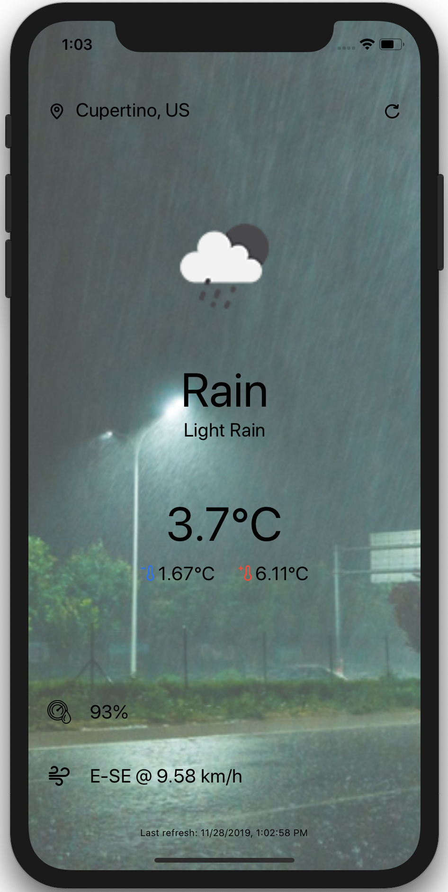

# Simple Weather App

## An introduction to React native

### Before the workshop...

A little work to make sure you have everything ready before the workshop starts is required:

1. [Get access to the Weather API](./openweather.md)
2. [Get your laptop ready for creating the app](./prerequisites.md)

### During the workshop...

After a [high level introduction to React Native](https://docs.google.com/presentation/d/1itQG0ty2kzIGfiE-Mvt2ptKumbVsFERPOcvtTwOquGI/edit?usp=sharing), and presenting the differences between React Native, Flutter, ... we will create a small weather app to practice some of the basic concepts of React Native.

The app that we will create will use the geolocation of the device and use it to fetch the weather information from the OpenWeather API. It will use those info to create the desired UI.

The output of your work should look like this once it's complete:

### Let's get started!

We can now [start working on the application](./workshop/intro.md)!
