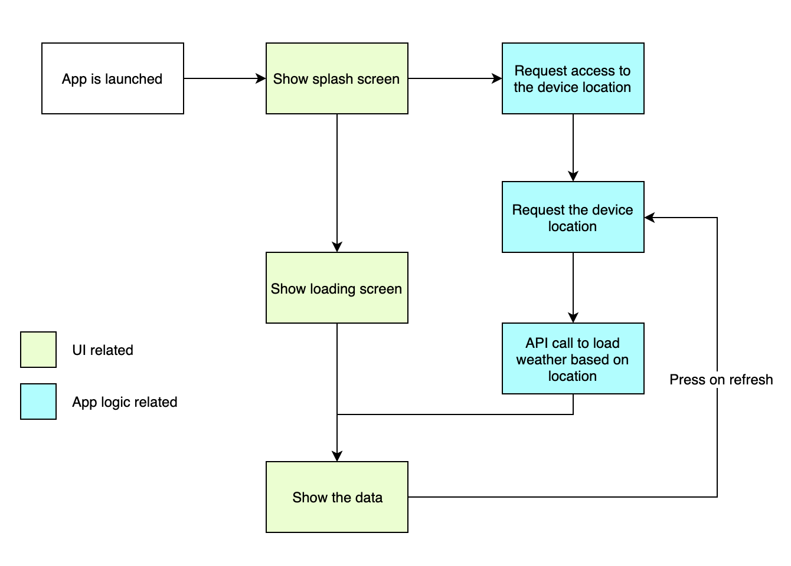

# Introduction

As mentionned React Native, like React and a few other framework out there is based on **components**. Those are responsible for a very specific part of the application and are then aggregated like Lego pieces in order to form the desired result.

In the case of this application, we will be using the concept of **hooks** from React as data provider. From a very high level, hooks are like functions that expose a set of variables and/or function to the component using them. (Don't worry, the hooks needed for this application are provided, you won't have to write them 😉).

>💡 The `develop` branch of the repository provides a squeleton of the application that we will build as well as some components, hooks and other utility functions that we will explore during this exercise.

# Third party framework used in this application

In this application, we will be using [UI Kitten](https://akveo.github.io/react-native-ui-kitten/), a framework exposing a [design system](https://eva.design/?utm_source=eva_documentation&utm_medium=hero), [components](https://akveo.github.io/react-native-ui-kitten/docs/components/components-overview) and fully integrated with [Eva Icons](https://akveo.github.io/eva-icons/#/).

>💡 This framework is not required as we can achieve the same result without it but it's to show you that it is possible in React Native.


# Flow of the application

The flow of the application is pretty simple. See the following diagram for a clear picture of what we will be using.

<div width="100%" style="display: flex; justify-content: center"></div>

We will maily focus on the UI related steps as the goal of this workshop isn't to teach you React/React native or how to pull out data from an API. The hooks that are part of this project are in charge of that. Let's have a quick look at those...

# Hooks

Two hooks are provided for your convenience:

- `useLocation`: provides everything needed to retrieve the user's location as well as the last refresh date and a function to trigger a refresh of the location and thus the weather forecast. It also exposes some status that will be useful for the application. Mode details about this hook will follow.

- `useForecast`: provides the mechanism to load the data as well as the formatted weather data themselves.

## useLocation hook

Let's have a quick look at the interesting code inside this hook:

```typescript
import * as Location from 'expo-location';
import { askAsync, LOCATION } from 'expo-permissions';
import { LocationData } from 'expo-location';

export const useLocation = () => {
  // ...

  const getLocationAsync = async () => {
    let { status } = await askAsync(LOCATION);
    if (status !== 'granted') {
      setError('Permission to access location was denied');
    }

    let location = await Location.getCurrentPositionAsync({});
    setLastRefresh(Date.now);
    setLocation({ ...location });
  };

  // ...
};
```

This function is an asynchronous function that will first request authorisation to access the device location via Expo `askAsync(LOCATION)`. 

Once the access is granted by the user, we use Expo one more time to access the current position of the device `Location.getCurrentPositionAsync({})`. 

Once the location is found, it will save the timestamp of the the last access to the position (`setLastRefresh(Date.now)`) and the result of the positioning (`setLocation({ ...location })`).

> Note that we won't be interacting directly with this hook. It will be used internally by the `useForecast` hook describe below.

## useForecast hook

Thia hook is the one responsible of fetching the data using the OpenWeather API. It uses the `useLocation` hook in order to get the coordinates for which the forecast should be loaded.

The interesting part here is:

```typescript
const getWeather = async (latitude: number, longitude: number) => {
  let url = `http://api.openweathermap.org/data/2.5/weather?lat=${latitude}&lon=${longitude}&units=metric&appid=${API_KEY}`;

  const forecast = transformForecast(await fetch(url).then(forecast => forecast.json()));
  setForecast(forecast);
  setLoading(false);
  setRefreshing(false);
};
```

This function does the actual call to the API. It uses the `API_KEY` that OpenWeather provided to you upon registration. It builds the URL that will be used to query this API. 

As you can see we will be using the position of the user together with this`API_KEY`. As you might have understood by now, the coordinates where retrived by the `useLocation` hook and passed to this one.

Once the data are loaded (yes of course it's asynchronous!) we will transform the raw forecast from the API into some more tailored structure for our app. The utility method `transformForecast` is in charge of that.

The transformed data are then "saved" together with the loading and refreshing flags set to `false` (as the data are now loaded).

Our application will be accessing these data in order to react accordingly. More on that later...

---

Next: [Current state of our project ➤](./guide_2.md)
