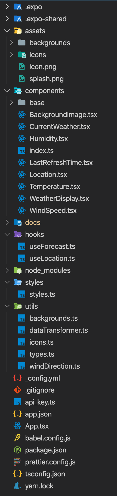
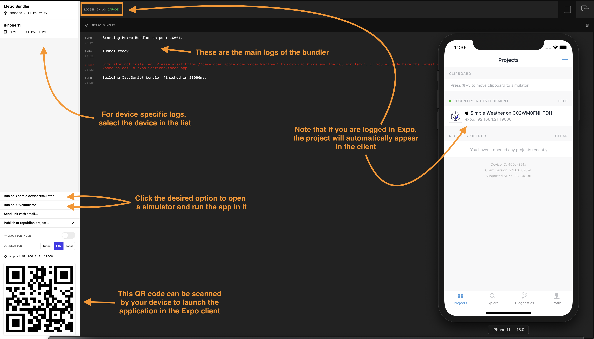
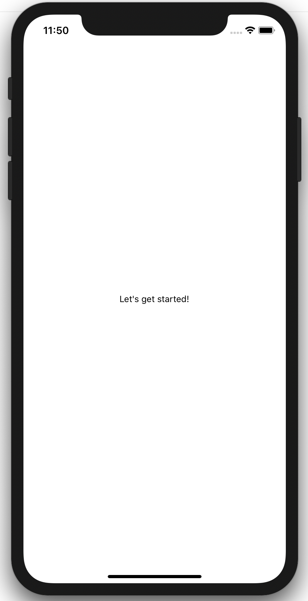

# Current state of our project

## The project structure

<table>
<tr>
<td width="190px">

</td>
<td>
<ul>
<li><code>assets</code>: This folder contains the project assets such as the images, icons,... that we will use within the application. As you can see the project comes with folders containing backgrounds and icons. The <code>icon.png</code> and <code>splash.png</code> are used by React Native to know what's your application icon and the image to show when the application is launched (splash screen).</li><br>
<li><code>components</code>: This folder will contain all the components that we will use in the project. At this point there is not much in those files but we will complete those in order to show what we want. The <code>base</code> folder is a folder containing some basic component that are all ready to be used by the others. You won't have to change those, except if you want to.</li><br>
<li><code>hooks</code>: This folder contains the two hookks we just saw in the previous section, ready to be used by our application. Once again, you won't need to change anything in there, except if you know what you are doing.</li><br>
<li><code>styles</code>: This folder contains the whole styling logic of the application. We will discuss a bit more about that in the future steps. For now, just know that the styles are defined for you and can easily be change if you desire. This is just purely CSS.</li><br>
<li><code>utils</code>: This folder contains some utility functions that we will use later on in this workshop. We will discuss those as we will encounter their usage.</li><br>
<li><code>api_key.ts</code>: This file is non existant in your version of the project. Creating this file and exposing your API key will be the first task you will tackle.</li><br>
<li><code>App.tsx</code>: This file is the entry point of the application. It can simply contain the component forming the application or refer to more complex components that in turn will define our application. In this intro, we will mainly work in this file.</li><br>
<li>The other files are automatically generated for you and are not part of this introduction workshop.</li>
</ul>
</td>
</tr>
</table><br>

## 🗒 Your first task 
### Setup your API key

>**Create the `api_key.ts` file in the root of the project and copy the following:** 
>
```typescript
export const API_KEY = '<YOUR_API_KEY>';
```
>

💡 Check [where to find my API key](./api_key.md) if you haven't copied it somewhere.

Once this is done it's time to run the application for the first time!

## Running the application
In order to run the application (either on your actual device or in a simulator) we will use the Expo CLI that you have installed before this workshop.

Before that, let's make sure all the required dependencies are properly installed (step 3). This only needs to be run once so the next time you want to run the application, skip the step 3.

1. Open your favorite shell application (Terminal, iTerm, ...)
2. Navigate to the folder where you checked out the project
3. Run the command `yarn` (This only needs to be run once so the next time you want to run the application, skip to the next step)
4. Run the command `expo start`

This last command will start a tunnel that the Expo client on your device (or simulator) will use to run the app. It will open a tool called the 'Metro Bundler' that allows you to follow what is happening behind the scenes.

### Expo Metro Bundler



### Expo client

On your device, simply scan the QR code or launch the Expo client, login (if you didn't do it yet) and tap on the project that should be listed in the `Recently in development` section.

You should see the following screen once everything is compiled and running on your device:



All right, that was easy! 

You are all set to [start putting the application together](./guide_3.md)!

---

Next: [Adding some components in the application ➤](./guide_3.md)