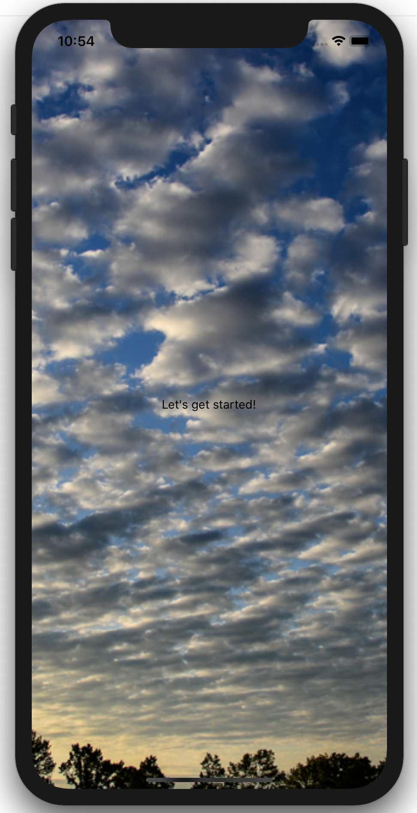
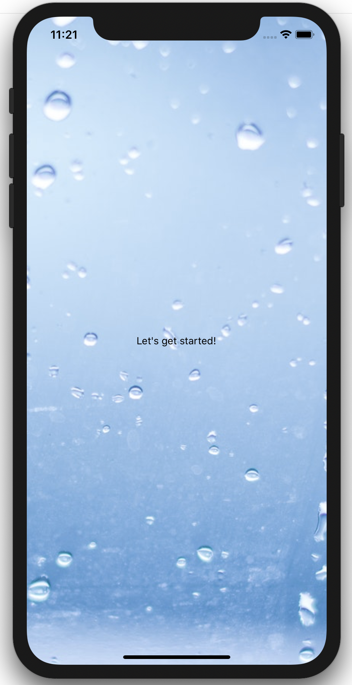

# Adding some components in the application

## The `App.tsx` file

As mentionned before, this is the entry point of the application. It is written in typescript using the latest React paradigms. 

* It uses the `useForecast` hook in order to pull out the data for the current location from the OpenWeather API.
* It is written as a functional component

>💡 The code contains some comment in order to make you understand what is happening.

```typescript
<>
      {/* Add the icon registry to have access to all the EvaIcons. Available icons: https://akveo.github.io/eva-icons/#/*/}
      <IconRegistry icons={EvaIconsPack} />
      {/* Application provider for UI Kitten. See https://akveo.github.io/react-native-ui-kitten/ */}
      <ApplicationProvider mapping={mapping} theme={lightTheme}>
        <View style={ appStyles.container }>
          {/* If the application is loading, show the device loader */}
          { loading && <ActivityIndicator size="large" color="#FFF" /> }
          {/* if the data are loaded, show the app */}
            {!loading && forecast && (
              <View style={{justifyContent:'center', alignItems:'center'}}>
                <Text>Let's get started!</Text>
              </View>
            )}
          </View>
      </ApplicationProvider>
    </>
```

Some tags in this code may get your attention. Those are not a standard HTML tag but is provided by React Native.

* `View` represents a container (like a div in HTML) and will be transformed into the corresponding native element dependant of the platform.
* `ActivityIndicator` will be transform into the corresponding platform loading indicator
* `Text` that allows us to display texts in the application. 

>💡 In React Native, even though looking very similar to HTML, you cannot simply add a string to display some text. All texts should be wrapped into this `Text` tag. It allows React Native to map this to the correct element displaying texts for the targeted platform running the application.

## Let's add some background

First, let's add a nice background to our app. In order to do so we will modify this `app.tsx` file by copying the following code:

```typescript
<BackgroundImage conditions={forecast && forecast.weather ? forecast.weather.icon : 'none'}>
```
right after the `ApplicationProvider` opening tag, and let's close it with 

```typescript
</BackgroundImage>
```
just before the closing `ApplicationProvider` tag.

This code is actually adding the component `BackgroundImage` that you can find in the `components` folder to our application. As you may have noticed, we are passing some props (React terminology for "properties") to this component.

Let's have a closer look...

```typescript
conditions={forecast && forecast.weather ? forecast.weather.icon : 'none'}
```

`conditions` is the name of the property, the rest is the value. It's surrounded by curly braces to tell the compiler that the value will come from a javascript expression. In this case it could be translated to:

```
if we have a forecast and that forecast object has a weather property,
use the icon property of this weather as value, otherwise use the string 'none'
```

### The `BackgroundImage` component
You can check the content of the `BackgroundImage` component:

```typescript
export const BackgroundImage = ({
  conditions,
  children,
}: {
  conditions: string;
  children: ReactNode;
}) => (
  <ImageBackground style={backgroundImageStyles.background} source={getBackground(conditions)}>
    {children}
  </ImageBackground>
);
```

This component expect to receive two parameters (or properties):

* conditions: the prop we discussed just before,
* children: this is a special prop that means that we expect this component to contain some other components.

You probably noticed that this custom component uses a React Native component: `ImageBackground`.

The `ImageBackground` component allows us to define an Image that will be placed in a layer under whatever children component defined inside. We then pass the desired style and the image source. 

>💡 For more details about this component, refer to the React Native [documentation](https://facebook.github.io/react-native/docs/imagebackground).

We use the utility method `getBackground` provided in the project in order to get the desired image. This image will depend of the value of the `conditions` props in order to have a different background according to the current weather.

The application on your device should reload as you save the file and should now look something like this:

 or 

>💡 There are a total of 18 possible background depending of the weather. 
>
>The file names of those background contains a suffix like `01D`, `01N`, ... because they are mapped to the possible `weather.icon` values that we receive from the API and pass to the component via the `condition` prop. There is actually one more background mapped to the `none` value that we pass if the weather is not yet loaded.
>
>The full list of possible `weather.icon` values can be found [here](https://openweathermap.org/weather-conditions). The two numbers define a weather type (clear sky, few clouds, ...) and the letter D or N stands for day or night.

That was a good start! Let's [continue](./guide_4.md) and add the other components to our `app.tsx` file...

---

Next: [Scaffolding our application ➤](./guide_4.md)