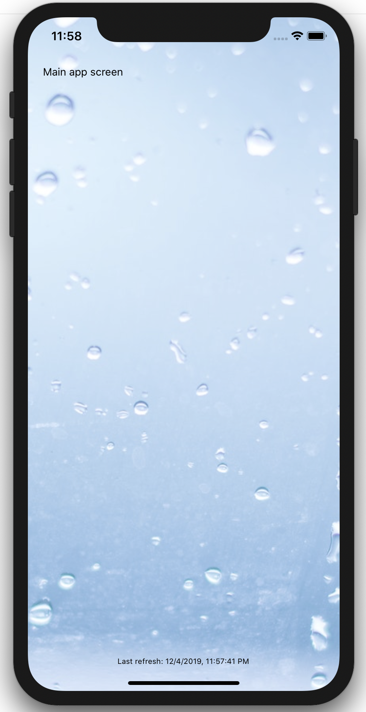
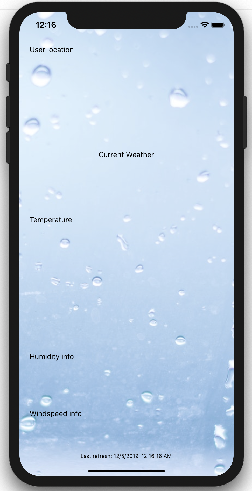

# Scaffolding our application

Now that we have the background, let's replace that `Let's get started!` text with actual components.

## Adding the components to the `App.tsx` file

Let's replace everything within the `` opening and closing tags with the following:

```typescript
<View style={appStyles.container}>
  {/* If the application is loading, show the device loader */}
  {loading && <ActivityIndicator size="large" color="#FFF" />}
  {/* if the data are loaded, show the app */}
  {!loading && forecast && (
    <View style={appStyles.globalContainer}>
      <SafeAreaView style={appStyles.safearea}>
        <WeatherDisplay forecast={forecast} refresh={refreshWeather} />
        <View style={{ alignItems: 'center' }}>
          <LastRefreshTime lastRefresh={lastRefresh} />
        </View>
      </SafeAreaView>
    </View>
  )}
</View>
```

After saving this, your app should reload and show a screen similar to this:



If you check the code you copied, you will notice some new components:

* `SafeAreaView`: this component is a React Native component allowing us to deal with the phones having a notch, such as the iPhones starting at the X model. It will automatically define which 'zone' of the screen is safe to display content. Whitout this component, the `Main app screen text` would be hidden behind the clock...

* `WeatherDisplay`: this is our main application component, we will work on it next

* `LastRefreshTime`: this is a very simple custom component displaying the last refresh date and time based on the `lastRefresh` prop that we pass to it. The value of this prop is provided by the `useLocation` hook by keeping a reference to the last time the location was retrieved.

>💡 You can try removing the `SafeAreaView` component and see what it looks like on a device with a notch 😉.

## Adding components to the `WeatherDisplay.tsx` file

This component is in charge of putting the different Lego pieces together.

Replace the `Text` component by the following:

```typescript
<Location city={location.city} country={location.country} refresh={refresh} />
<CurrentWeather weather={weather} />
<Temperature temp={info.temp} temp_min={info.temp_min} temp_max={info.temp_max} />
<Humidity humidity={info.humidity} />
<WindSpeed direction={wind.direction} speed={wind.speed} />
``` 

As you now know, those are custom components with very specific goals, their names are pretty explicit!

Your application should now look like:



👍 Good job so far! Let's add some content in those components [next](./guide_5.md).

---

Next: [Adding content in the different components ➤](./guide_4.md)