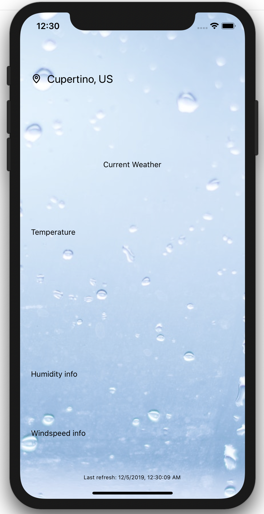
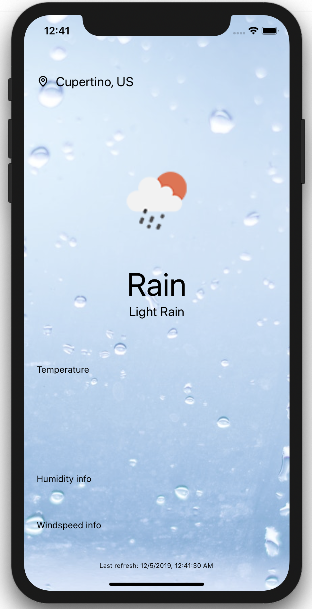
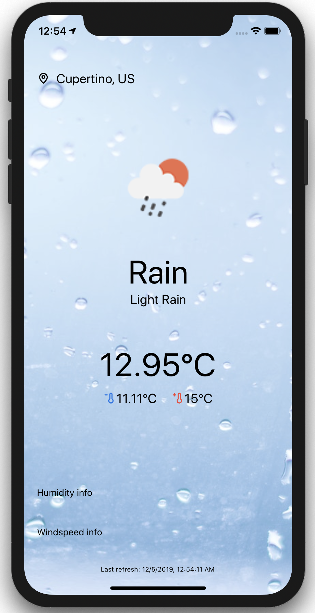
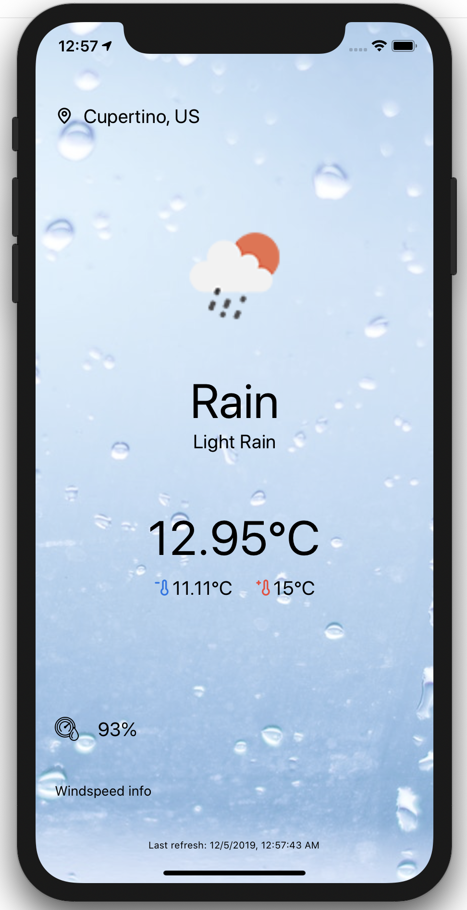
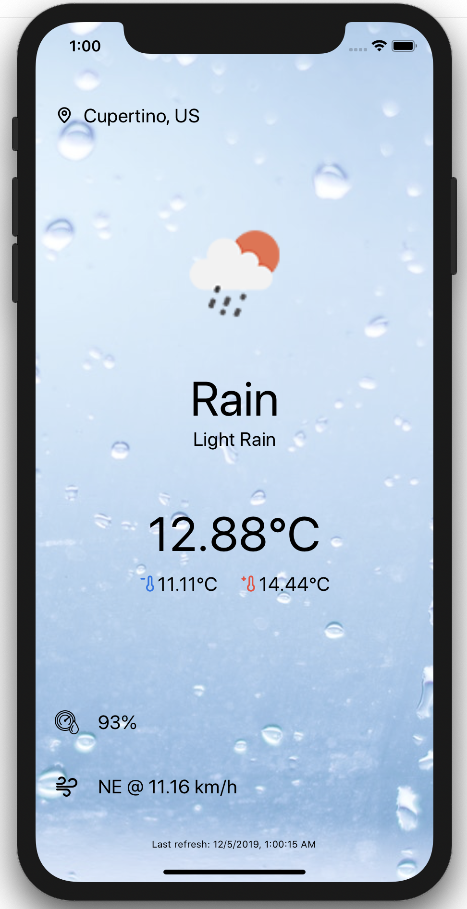

# Adding content in the different components

Our application is in a really good shape so far. We have added the background, made sure it works on all devices even the ones with notch and scaffolded the different components.

It's now time to fill these components with data!

## User location

Head to the `Location.tsx` file under the component folder and replace the `Text` tag with the following:

```typescript
<View style={locationStyles.container}>
  <View>
    <LocationIcon />
  </View>
  <View>
    <LocationText city={city} country={country} />
  </View>
</View>
```

As you can see we use two custom components in order to build our UI:

* `LocationIcon`: one liner component using the Icon component of UI Kitten to display the location icon from the Eva icon pack.

```typescript
<Icon name="pin-outline" width={20} height={20} fill="#000" />
```

* `LocationText`: also a super small component displaying a `Text` component from React Native containing the city and the country resolving to the device geo-location.

Your application should now display something similar to



## Current weather

Let's now add the current weather data. Go to the `CurrentWeather.tsx` file and as usual, copy the following code and replace the `Text` tag:

```typescript
<View>
  <WeatherIcon icon={icon} />
</View>
<View>
  <Text style={currentWeatherStyles.short}>{short}</Text>
  <Text style={currentWeatherStyles.long}>{long}</Text>
</View>
```

We once again use a custom component in order to display the correct weather icon based on the API answer. 

This `WeatherIcon` component is a bit more complex than the `LocationIcon` icon we used for the location component.

```typescript
export const WeatherIcon = ({ icon }: { icon: string }) => (
  <Image
    style={styles.weatherIcon}
    source={{
      uri: `https://openweathermap.org/img/wn/${icon}@2x.png`,
    }}
  />
);
```
This 'icon' is actually an image that is rendered via the `Image` component of React Native. As you can see this component is very similar to the `ImageBackground` component we used to display the application background. 

>💡 Despite the similarity there is a **huge** difference: `Image` in react native cannot have any content while `ImageBackground` can... 
>
>So depending of what you are trying to achieve, choose the correct one ☝️ 

Your application should now look like



## Temperature
In order to add the current temperature information, replace the `Text` tag in the `Temperature.tsx` file with

```typescript
<View style={temperatureStyles.tempContainer}>
  <Text style={temperatureStyles.currentTemp}>{`${temp}℃`}</Text>
</View>
<MinMaxTemp min={temp_min} max={temp_max} />
```



## Relative humidity

```typescript
<HumidityIcon />
<Text style={humidityStyles.text}>{`${humidity}%`}</Text>
```



## Wind information

```typescript
<WindSpeedIcon />
<Text style={windSpeedStyles.text}>{`${direction} @ ${transformMStoKMH(speed)} km/h`}</Text>
```


